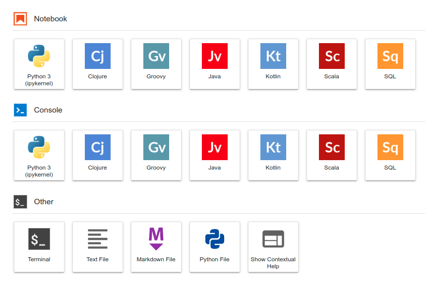

# Docker-JupyterLab

## Notebooks

- [Python3](https://www.python.org)
    - [OpenCV](https://opencv.org)
    - [PyImageJ](https://github.com/imagej/pyimagej)
        - [Clojure](https://clojure.org/)
        - [Groovy](http://groovy-lang.org/)
        - [Java](https://www.java.com/)
        - [Kotlin](https://kotlinlang.org/)
        - [Scala](https://www.scala-lang.org/)
        - SQL
- [Julia 1.7.3](https://julialang.org)
- [R](https://www.r-project.org)
<!-- - [ImageJ](https://imagej.nih.gov/ij/)
- [BeakerX](http://beakerx.com)
- [OpenJDK](https://openjdk.java.net) -->



## Usage

### Docker pull command

```
 docker pull ken2s/jupyterlab
```

### Create and start containers in the background

```
 docker-compose up -d
```

## URLs
- https://github.com/ken2s/jupyterlab
- https://hub.docker.com/r/ken2s/jupyterlab
